# Xổ Số Miền Nam & Miền Trung — Dữ Liệu Tự Động Hàng Ngày

Thu thập và lưu trữ kết quả **Xổ Số Miền Nam (XSMN)** và **Xổ Số Miền Trung (XSMT)** tự động mỗi ngày bằng GitHub Actions, nguồn từ [minhngoc.net.vn](https://www.minhngoc.net.vn).

- **XSMN**: Dữ liệu từ **01/01/2008** — TP.HCM, Vũng Tàu, Long An, Bến Tre, Tiền Giang, Đồng Tháp, Cần Thơ, An Giang, ...
- **XSMT**: Dữ liệu từ **27/01/2009** — Đà Nẵng, Khánh Hòa, Huế, Quảng Nam, Bình Định, Gia Lai, Đắk Lắk, ...

---

## Tải Dữ Liệu Nhanh

### Xổ Số Miền Nam (XSMN)

| Định dạng | CSV | JSON |
|-----------|-----|------|
| Thô — đầy đủ số | [xsmn.csv](data/xsmn/xsmn.csv) | [xsmn.json](data/xsmn/xsmn.json) |
| 2 chữ số (lô tô) | [xsmn-2-digits.csv](data/xsmn/xsmn-2-digits.csv) | [xsmn-2-digits.json](data/xsmn/xsmn-2-digits.json) |
| Dạng thưa (sparse) | [xsmn-sparse.csv](data/xsmn/xsmn-sparse.csv) | [xsmn-sparse.json](data/xsmn/xsmn-sparse.json) |

### Xổ Số Miền Trung (XSMT)

| Định dạng | CSV | JSON |
|-----------|-----|------|
| Thô — đầy đủ số | [xsmt.csv](data/xsmt/xsmt.csv) | [xsmt.json](data/xsmt/xsmt.json) |
| 2 chữ số (lô tô) | [xsmt-2-digits.csv](data/xsmt/xsmt-2-digits.csv) | [xsmt-2-digits.json](data/xsmt/xsmt-2-digits.json) |
| Dạng thưa (sparse) | [xsmt-sparse.csv](data/xsmt/xsmt-sparse.csv) | [xsmt-sparse.json](data/xsmt/xsmt-sparse.json) |

---

## Truy Cập Qua URL (Public API)

Dữ liệu được cập nhật tự động và có thể truy cập trực tiếp qua URL raw GitHub:

```
https://raw.githubusercontent.com/tuanseo5t-alt/xosomn-xosomt/main/data/xsmn/xsmn.csv
https://raw.githubusercontent.com/tuanseo5t-alt/xosomn-xosomt/main/data/xsmn/xsmn-2-digits.csv
https://raw.githubusercontent.com/tuanseo5t-alt/xosomn-xosomt/main/data/xsmn/xsmn-sparse.csv

https://raw.githubusercontent.com/tuanseo5t-alt/xosomn-xosomt/main/data/xsmt/xsmt.csv
https://raw.githubusercontent.com/tuanseo5t-alt/xosomn-xosomt/main/data/xsmt/xsmt-2-digits.csv
https://raw.githubusercontent.com/tuanseo5t-alt/xosomn-xosomt/main/data/xsmt/xsmt-sparse.csv
```

### Dùng Python (pandas)

```python
import pandas as pd

BASE = "https://raw.githubusercontent.com/tuanseo5t-alt/xosomn-xosomt/main/data"

# Đọc XSMN dạng lô tô (2 chữ số)
df = pd.read_csv(f"{BASE}/xsmn/xsmn-2-digits.csv")
print(df.tail(10))

# Lọc theo đài cụ thể
hcm = df[df["station"] == "Hồ Chí Minh"]

# Lọc theo ngày
df["date"] = pd.to_datetime(df["date"])
thang4 = df[df["date"].dt.month == 4]
```

### Dùng JavaScript / Node.js

```javascript
const res = await fetch(
  "https://raw.githubusercontent.com/tuanseo5t-alt/xosomn-xosomt/main/data/xsmn/xsmn.json"
);
const data = await res.json();

// Lọc theo đài
const vungTau = data.filter(r => r.station === "Vũng Tàu");

// Lọc theo ngày
const homNay = data.filter(r => r.date === "2026-04-04");
```

### Dùng wget / curl

```bash
wget https://raw.githubusercontent.com/tuanseo5t-alt/xosomn-xosomt/main/data/xsmn/xsmn.csv

curl https://raw.githubusercontent.com/tuanseo5t-alt/xosomn-xosomt/main/data/xsmt/xsmt-2-digits.csv
```

---

## Cấu Trúc File CSV

Mỗi dòng = kết quả **một đài** trong **một ngày**:

| Cột | Ý nghĩa | Ví dụ |
|-----|---------|-------|
| `date` | Ngày quay số | `2026-04-04` |
| `station` | Tên đài | `Hồ Chí Minh` |
| `special` | Giải Đặc Biệt | `269291` |
| `first` | Giải Nhất | `47750` |
| `second` | Giải Nhì | `42151` |
| `third` | Giải Ba (2 số) | `91137, 04261` |
| `fourth` | Giải Tư (7 số) | `61033, 60231, ...` |
| `fifth` | Giải Năm | `1216` |
| `sixth` | Giải Sáu (3 số) | `875549, 254418` |
| `seventh` | Giải Bảy | `469` |
| `eighth` | Giải Tám | `00` |

> File **2-digits** chỉ lấy **2 chữ số cuối** mỗi giải (dùng cho lô tô).
> File **sparse** mỗi số là một dòng riêng (dùng cho phân tích thống kê).

---

## Biểu Đồ Phân Tích

### XSMN

<details>
<summary>Tần suất Lô Tô — Heatmap (1 năm gần nhất)</summary>

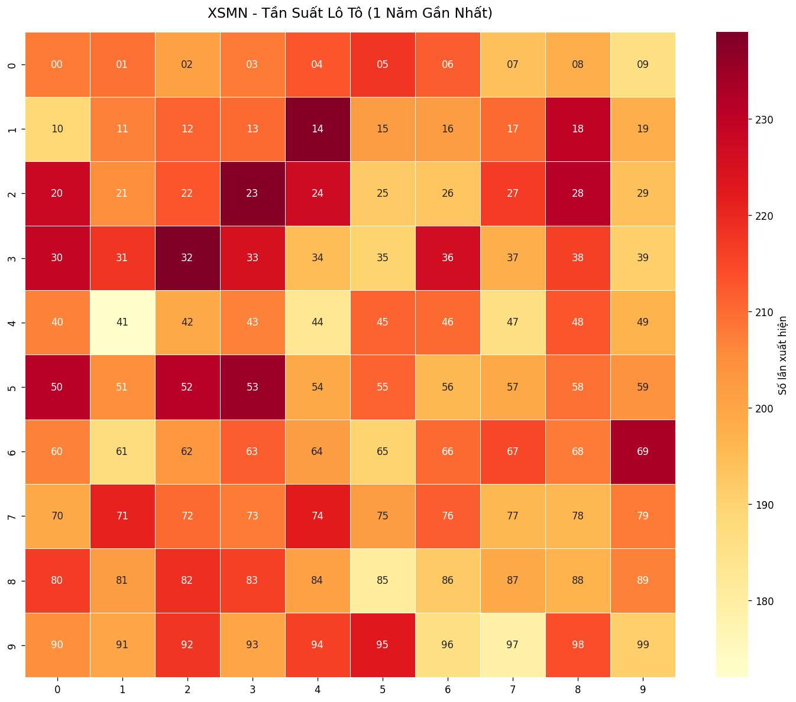
</details>

<details>
<summary>Top 10 số xuất hiện nhiều nhất</summary>

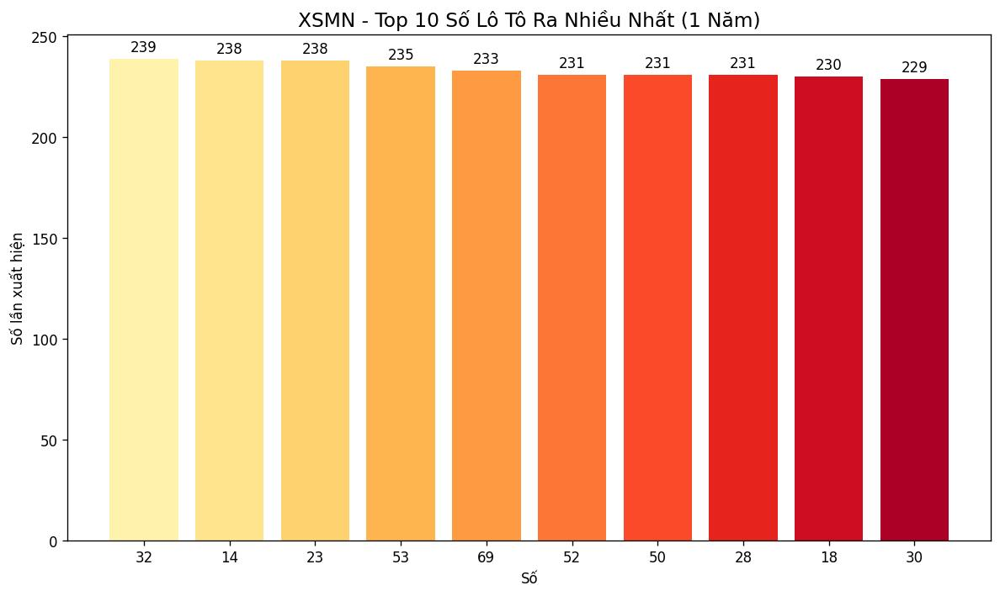
</details>

<details>
<summary>Phân bổ tần suất xuất hiện</summary>

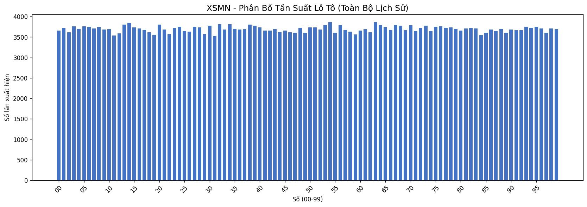
</details>

<details>
<summary>Số ngày vắng mặt — Lô Tô (delta)</summary>

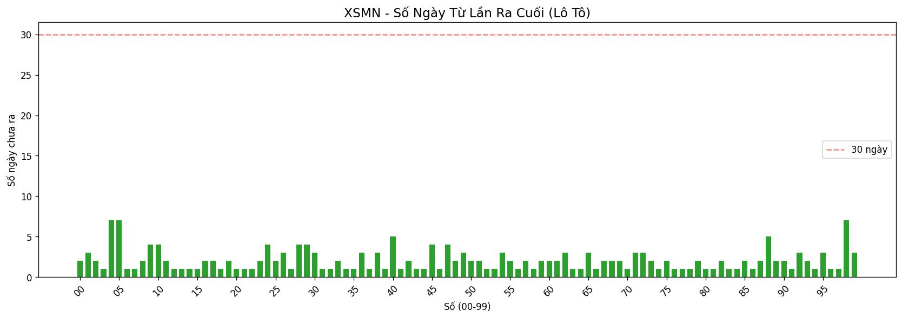
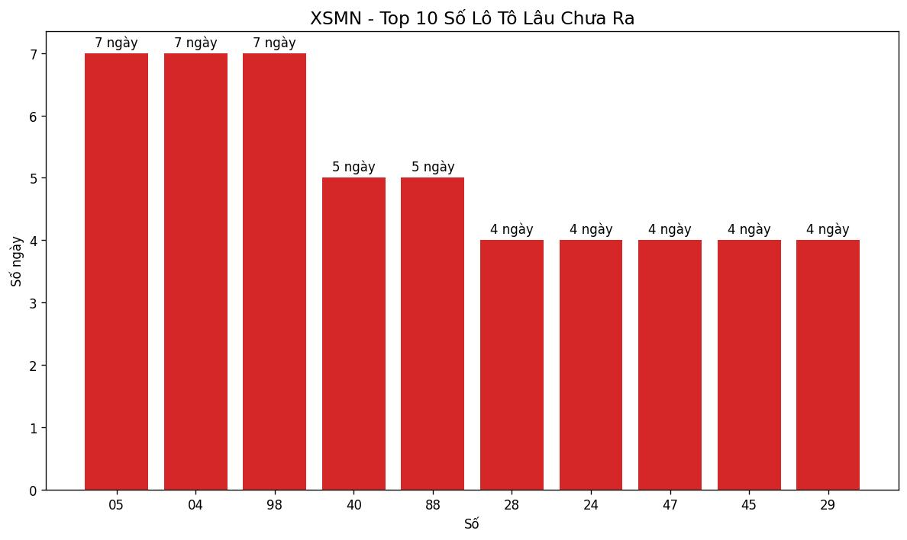
</details>

<details>
<summary>Số ngày vắng mặt — Giải Đặc Biệt</summary>

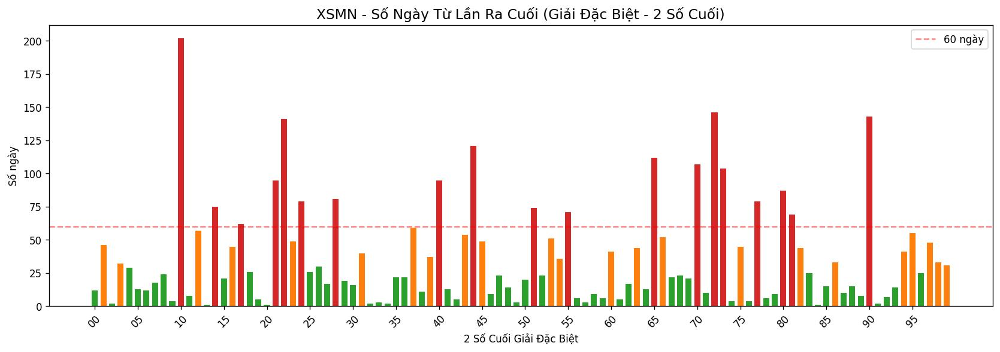
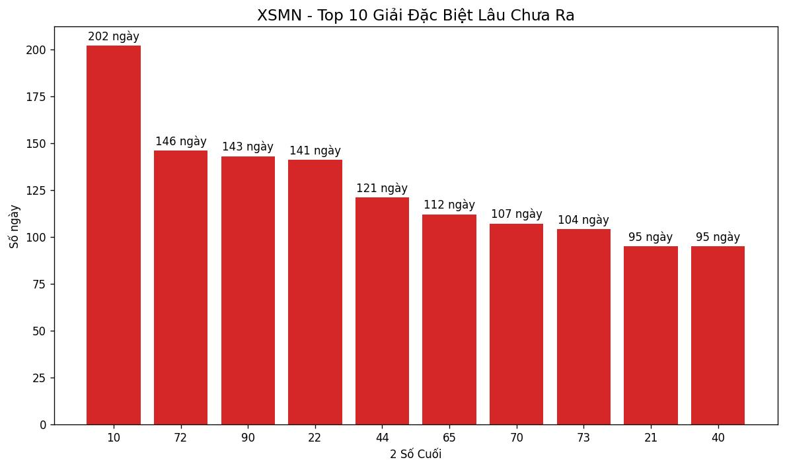
</details>

### XSMT

<details>
<summary>Tần suất Lô Tô — Heatmap (1 năm gần nhất)</summary>

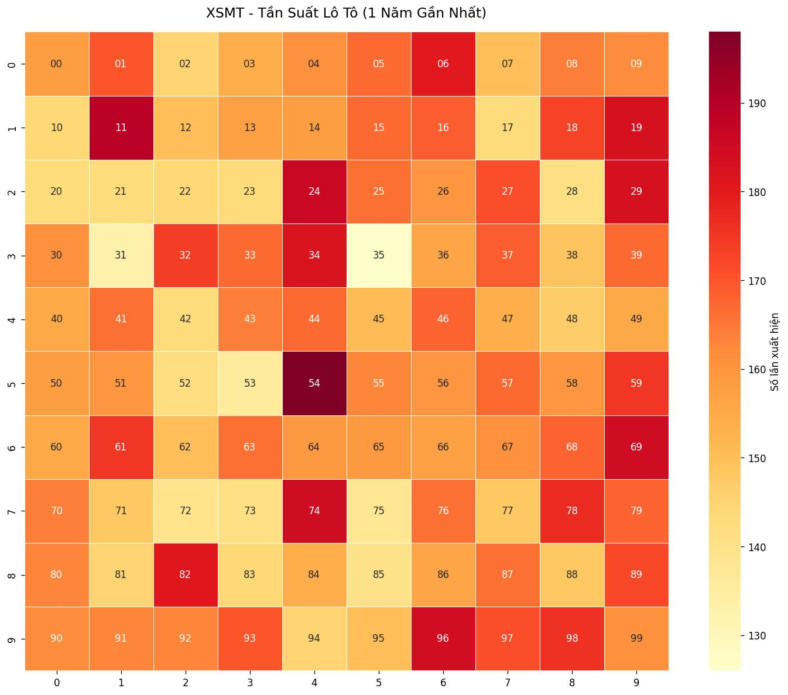
</details>

<details>
<summary>Top 10 số xuất hiện nhiều nhất</summary>

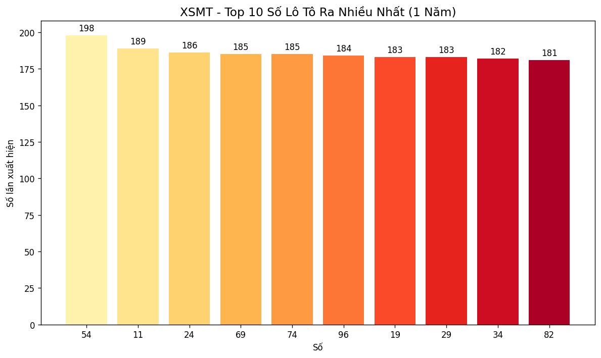
</details>

<details>
<summary>Phân bổ tần suất xuất hiện</summary>

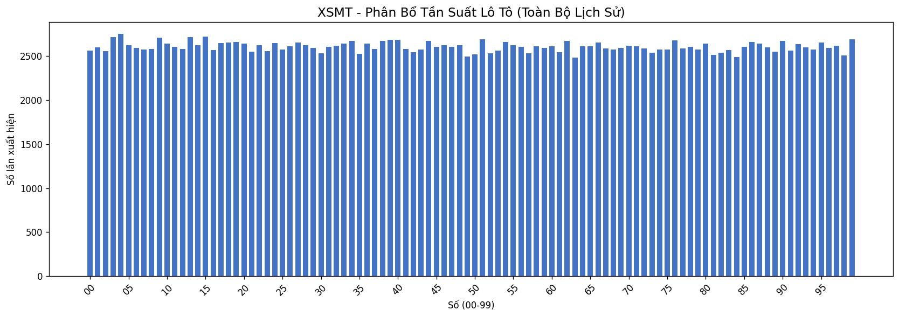
</details>

<details>
<summary>Số ngày vắng mặt — Giải Đặc Biệt</summary>

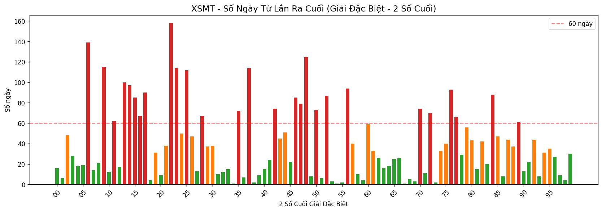
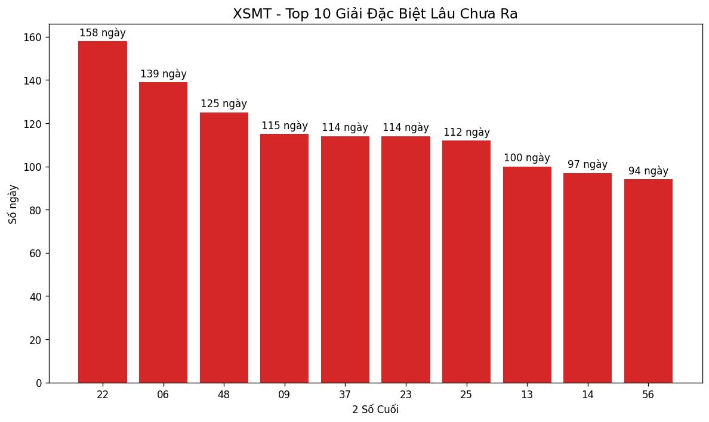
</details>

---

## Lịch Tự Động Chạy

| Workflow | Giờ chạy | Mô tả |
|----------|----------|-------|
| Fetch XSMN Daily | 17:00 VN (10:00 UTC) | Lấy kết quả XSMN ngày hôm đó |
| Fetch XSMT Daily | 17:05 VN (10:05 UTC) | Lấy kết quả XSMT ngày hôm đó |
| Backfill XSMN | Thủ công | Lấy toàn bộ lịch sử từ 2008 |
| Backfill XSMT | Thủ công | Lấy toàn bộ lịch sử từ 2009 |

---

## Chạy Thủ Công Trên Máy

```bash
# Cài thư viện
pip install -r requirements.txt

# Lấy dữ liệu hôm nay
python src/main_xsmn.py
python src/main_xsmt.py

# Lấy dữ liệu một khoảng ngày
python src/main_xsmn.py --from 2026-01-01 --to 2026-04-04

# Lấy toàn bộ lịch sử
python src/main_xsmn.py --all
python src/main_xsmt.py --all
```

---

## Cấu Trúc Thư Mục

```
xosomn-xosomt/
├── src/
│   ├── fetcher_xsmn.py      # Thu thập XSMN
│   ├── fetcher_xsmt.py      # Thu thập XSMT
│   ├── storage.py           # Lưu CSV / JSON
│   ├── analyzer.py          # Vẽ biểu đồ
│   ├── main_xsmn.py         # Script chính XSMN
│   └── main_xsmt.py         # Script chính XSMT
├── data/
│   ├── xsmn/                # Dữ liệu XSMN (CSV + JSON)
│   └── xsmt/                # Dữ liệu XSMT (CSV + JSON)
├── images/
│   ├── xsmn/                # Biểu đồ XSMN
│   └── xsmt/                # Biểu đồ XSMT
├── .github/workflows/       # GitHub Actions
└── requirements.txt
```

---

## License

MIT — Dữ liệu được cung cấp miễn phí, tự do sử dụng cho mọi mục đích.

Nguồn dữ liệu: [minhngoc.net.vn](https://www.minhngoc.net.vn)
